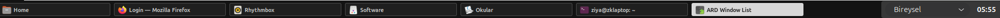
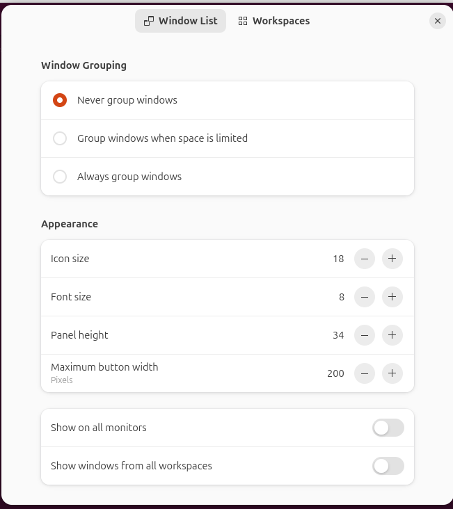

# ARD Window List/Taskbar

**Adaptive Responsive Desktop Window List/Taskbar**

ARD Window List/Taskbar is a GNOME Shell Extension for a customizable taskbar, window list, and bottom panel. It adapts window grouping to available space and provides workspace controls and live appearance settings.

Repository: [ziyakarakaya/ard-window-list](https://github.com/ziyakarakaya/ard-window-list)

Extension UUID: `ard-window-list@ziyakarakaya.github.io`

## Supported environment

GNOME Shell **50** is the only version declared in `metadata.json`. The project
targets Ubuntu 26.04.1 LTS, GNOME Shell 50.1, and Wayland. Other Shell versions and
X11 have not been validated here. A declaration of compatibility does not replace
testing in a running GNOME session.

## Features

- Bottom window list with window activation, focus indication, minimize/maximize,
  close actions, and drag-and-drop reordering.
- Never, automatic (when space is limited), or always group windows by application.
- Configurable icon size, title font size, panel height, and maximum button width;
  appearance settings apply live.
- Show the current workspace or all workspaces, and use the primary or all monitors.
- Workspace previews or workspace names, plus dynamic or fixed workspace controls.
- Light and dark styles, truncated-title tooltips, and grouped-window menus.

## Screenshots

### Window list



### Preferences


## Install from source

Requirements: GNOME Shell 50, `gnome-extensions`, Python 3.9 or newer, Node.js with
ES module syntax checking support, and `glib-compile-schemas` (on Ubuntu, provided
by `libglib2.0-bin`). Preferences use GTK 4 and libadwaita, supplied by a typical
GNOME desktop installation. Packaging requires no downloaded Python or npm packages.

```sh
git clone https://github.com/ziyakarakaya/ard-window-list.git
cd ard-window-list
python3 scripts/package.py
gnome-extensions install dist/ard-window-list@ziyakarakaya.github.io.shell-extension.zip
glib-compile-schemas "$HOME/.local/share/gnome-shell/extensions/ard-window-list@ziyakarakaya.github.io/schemas"
```

The explicit schema compilation ensures the installed source schema is available;
the ZIP deliberately excludes `gschemas.compiled`. Log out and back in after the
first installation on Wayland, then enable ARD Window List/Taskbar in the Extensions app,
or run:

```sh
gnome-extensions enable ard-window-list@ziyakarakaya.github.io
```

Installation and activation are manual steps. Packaging does neither. The install
command above is for a new installation and does not force replacement of an
existing extension. For an update, back up the installed copy and settings first,
then use the Extensions app or a deliberate replacement workflow.

## Preferences

Open the extension's settings in the Extensions app, or run:

```sh
gnome-extensions prefs ard-window-list@ziyakarakaya.github.io
```

The **Window List** page controls grouping, appearance, workspaces, and monitor
visibility. The **Workspaces** page controls previews/names and workspace behavior.
Dynamic workspaces and workspace count change GNOME's shared desktop settings.

An optional application launcher uses the generic `preferences-system` icon.
From this source checkout, install the template manually:

```sh
install -Dm644 data/ard-window-list-preferences.desktop "$HOME/.local/share/applications/ard-window-list-preferences.desktop"
```

It then opens preferences for the installed public UUID. The package script never
installs the launcher. The template is also included under `data/` in the ZIP.

## UUID migration and existing settings

The previous local UUID was `window-list-custom@ziya.local`. GNOME treats the public
UUID as a separate extension: its installation directory and enablement entry
change, and an installed local copy is not replaced automatically. Disable the old
copy manually before enabling the new one; running both can create duplicate
panels and they share preferences.

The GSettings schema ID **remains**
`org.gnome.shell.extensions.window-list-custom`, its enum ID remains unchanged, and
its path remains `/org/gnome/shell/extensions/window-list-custom/`. This deliberate
compatibility choice keeps existing preferences without copying or resetting them.
Renaming these later requires an explicit settings migration. No migration or
settings reset is performed by this release patch or packaging script.

## Development

Keep edits in this checkout until you intentionally install a test build. Preserve
GNOME Window List grouping, workspace/monitor filtering, activation, focus, and
drag-and-drop behavior, and clean up signals, actors, and sources on disable.
Configurable extension preferences belong in the GSettings schema. The existing
`gnome-shell-extensions` gettext domain is retained for inherited strings; this
repository currently has no translation catalogs for new strings.

Run the local validation commands before packaging:

```sh
git diff --check
node --input-type=module --check < extension.js
node --input-type=module --check < prefs.js
node --input-type=module --check < workspacePrefs.js
node --input-type=module --check < workspaceIndicator.js
glib-compile-schemas --strict --dry-run schemas
desktop-file-validate data/ard-window-list-preferences.desktop
```

Syntax checks do not execute GNOME Shell APIs. Before releasing, test preferences,
live appearance changes, grouping modes, multiple workspaces/monitors, drag-and-drop,
and repeated enable/disable cycles in a GNOME Shell 50 session. Check the session's
GNOME Shell journal for JavaScript errors. Those checks require an intentional
installation and are not run by the package script.

## Repository structure

| Path | Purpose |
| --- | --- |
| `metadata.json` | Public identity, Shell compatibility, and settings schema |
| `extension.js` | Bottom panel, windows, grouping, menus, and lifecycle |
| `prefs.js`, `workspacePrefs.js` | GTK/libadwaita preferences |
| `workspaceIndicator.js` | Workspace controls and previews |
| `stylesheet-*.css` | Light/dark Window List and workspace styles |
| `schemas/*.gschema.xml` | GSettings source schema |
| `data/ard-window-list-preferences.desktop` | Optional preferences launcher |
| `scripts/package.py` | Offline validation and release ZIP construction |
| `LICENSE`, `ATTRIBUTION.md` | GPL terms and upstream credit |
| `dist/` | Ignored generated release archives |

`extension.js.before-appearance` is a historical backup identical to the installed
GNOME Window List 50.0 reference, with no unique code required by ARD Window List/Taskbar.
It, the generated `schemas/gschemas.compiled`, and local development instructions
in `AGENTS.md` are ignored and excluded from release ZIPs. Existing local copies
are preserved. These files should be absent from the public source tree: untrack
them before publishing if they are still tracked in your checkout:

```sh
git rm --cached -- extension.js.before-appearance schemas/gschemas.compiled AGENTS.md
```

Removing them from tracking does not remove them from earlier commits. Also review
existing Git author email metadata before making its history public; packaging
never includes Git history.

Metadata follows GNOME Shell 50's required `uuid`, `name`, `description`, and
`shell-version` fields. `settings-schema` and `gettext-domain` are used by the
extension API, and `url` points to this project's repository. The inherited
`extension-id` auxiliary field has been removed: neither the Shell metadata loader
nor ARD code needs it, and this checkout has no upstream build system requiring
it. Extension lookup uses the UUID.

## Release packaging

```sh
python3 scripts/package.py
unzip -l dist/ard-window-list@ziyakarakaya.github.io.shell-extension.zip
unzip -t dist/ard-window-list@ziyakarakaya.github.io.shell-extension.zip
```

The script validates public metadata, preserved schema ID/path, strict schema
compilation in dry-run mode, and all four JavaScript modules before writing a ZIP.
`metadata.json` sits at the ZIP root, as required for GNOME extension installation.
An explicit allowlist includes runtime JavaScript, all four stylesheets, the XML
schema, README, license, attribution, and optional launcher. It excludes `.git`,
`AGENTS.md`, packaging tools, backups, editor files, and compiled schema artifacts,
including `schemas/gschemas.compiled`.

Output is `dist/ard-window-list@ziyakarakaya.github.io.shell-extension.zip`.
Existing files are never overwritten. To retain an earlier build, choose a new
output filename within the repository:

```sh
python3 scripts/package.py --output dist/ard-window-list-review-2.shell-extension.zip
```

For an **extensions.gnome.org (EGO) submission**, use the separate minimal mode:

```sh
python3 scripts/package.py --ego
unzip -l dist/ard-window-list@ziyakarakaya.github.io.ego.shell-extension.zip
unzip -t dist/ard-window-list@ziyakarakaya.github.io.ego.shell-extension.zip
```

The EGO ZIP contains only metadata, the four JavaScript modules, four stylesheets,
schema XML, `LICENSE`, and `ATTRIBUTION.md` (12 files). It excludes README and the
entire `data/` directory, including the optional desktop launcher, as well as all
development and generated artifacts excluded from the GitHub release ZIP.
Both modes run the same metadata, schema, and JavaScript validation. `--output`
also works with `--ego` to preserve an earlier submission candidate. Review against
[GNOME's review guidelines](https://gjs.guide/extensions/review-guidelines/review-guidelines.html)
before any eventual submission; building either ZIP does not submit it.

Identical source files produce identical archive bytes using fixed ZIP timestamps
and permissions with the same Python/zlib toolchain. No version number is invented
by the packager; select a release version and tag deliberately before publication.
Building the archive does not install, enable, commit, push, or publish anything.
Review the ZIP and test the installed extension before any eventual upload to
GNOME Extensions or a GitHub release.

## License and attribution

Copyright 2026 Ziya Karakaya for new release tooling, documentation, and launcher.
ARD Window List/Taskbar is free software under the **GNU General Public License, version 2
or (at your option) any later version** (`GPL-2.0-or-later`). See [LICENSE](LICENSE).
It is provided without warranty.

The code is substantially derived from **GNOME Shell Extensions Window List**,
with shared **Workspace Indicator** JavaScript and adapted workspace styles.
The provenance review compared the installed Ubuntu `gnome-shell-extensions`
package **50.0-1** (GNOME upstream version 50.0): `workspacePrefs.js` and the dark
workspace-switcher stylesheet match it byte for byte. The other JavaScript,
styles, and source schema retain that upstream implementation with ARD changes.
The backup also matches the installed upstream `extension.js` byte for byte.
This establishes a local comparison reference, not the exact original upstream
Git commit. Original copyright and GPL-2.0-or-later headers are preserved.
See [ATTRIBUTION.md](ATTRIBUTION.md) for the per-file mapping, local evidence,
contributors, and ARD-specific modifications. This independent derivative does
not claim GNOME endorsement or official GNOME support.
Report ARD Window List/Taskbar issues in
[this repository](https://github.com/ziyakarakaya/ard-window-list/issues).
